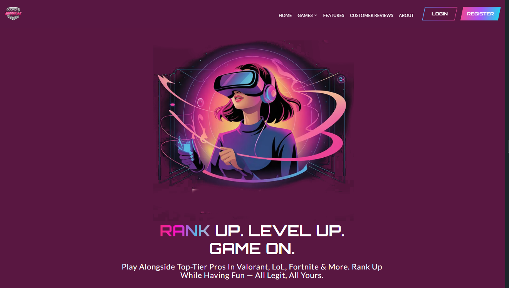

<h1 align="center">
  👋 Hi, I'm Uzair Saleem
</h1>

  <b>Full Stack Developer | Next.js | TypeScript | Python | Prisma | Tailwind | UI Frameworks</b>
   
  🚀 Passionate about building scalable web applications and crafting seamless user experiences. 

---

## 🛠️ Tech Stack

  

---

## 🧑‍💻 Technical Skills

### 📝 Programming Languages

### ⚛️ Frameworks & Libraries

### 🗄️ Databases & ORM

### 🧪 Testing & QA

### 🔐 Security & Authentication

### 🛠️ Tools & Workflow

### ☁️ Cloud & Deployment

### ⚙️ CI/CD & DevOps

### 🏗️ Architecture & Concepts
RESTful API Design, Monorepos, MVC, SSR, PWA, Agile/Scrum, Code Review, Unit/Integration/E2E Testing, Responsive Web Design, Performance Optimization

## 🌍 Connect with me

  
  
  

---

## ✨ Featured Project

  

  

### What is Diffed.gg?

**Diffed.gg** is a matchmaking and gaming services platform tailored for competitive and casual gamers. It offers premium experiences such as coaching, duo queueing, and exclusive rank based boosting. Key features include seamless authentication, integrated payments Checkout(Stripe/Paypal), Inplatform wallet System, Realtime Chat with coaches, admin dashboards, and player feedback systems.

> Level up your gameplay with top rated players.

---

## 🏆 GitHub Achievements & Stats

  

  

  
  

  

---

## 🧩 More About Me

- 🌏 Based in: <b>Pakistan (UTC+5)</b> & working remotely worldwide!
- 💻 Loves building with: Next.js, TypeScript, Prisma, Tailwind, and all things React.
- 🔍 Always exploring new UI frameworks and automation tools.
- 🤝 Open to collaboration on open source and innovative startup projects.
- ⚡ Fast learner, creative problem solver, and a team player.
- 📬 Available for freelance or full-time roles!

🦄 <b>Fun Facts</b>

 
<ul>
  <li>⚡ I love building developer tools and automations.</li>
  <li>🎧 Music, productivity, and code — my perfect trio.</li>
  <li>🌱 Always upskilling with the latest in tech.</li>
</ul>

